<p align="center">
  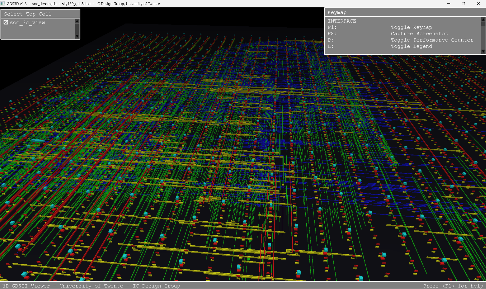
</p>

<h1 align="center">Reinforcement Learning-Driven Security Verification and Silicon Implementation of a RISC-V SoC</h1>

<p align="center">
  <em>From RTL to GDSII — An End-to-End AI-Augmented Hardware Security Verification Framework</em>
</p>

<div align="center">
  <table>
    <thead>
      <tr>
        <th>Core Architecture</th>
        <th>Target Node</th>
        <th>Signoff Status</th>
        <th>Verification Coverage</th>
        <th>License</th>
      </tr>
    </thead>
    <tbody>
      <tr>
        <td align="center">RISC-V RV32I</td>
        <td align="center">SkyWater 130nm</td>
        <td align="center">Zero DRC / LVS Clean</td>
        <td align="center">100% Functional & Security</td>
        <td align="center">MIT</td>
      </tr>
    </tbody>
  </table>
</div>

---

## Abstract

This project presents an end-to-end framework for designing, verifying, and physically implementing a security-hardened RISC-V System-on-Chip (SoC). The key contribution is a **closed-loop AI verification engine** that combines Reinforcement Learning (RL) with Large Language Model (LLM)-guided gap analysis to autonomously achieve comprehensive functional and security coverage - significantly reducing the manual effort traditionally required in hardware verification.

The SoC is taken from RTL through synthesis, placement, clock tree synthesis, routing, and final signoff using the **OpenROAD** open-source ASIC flow, targeting the **SkyWater 130nm** process node with **zero DRC, antenna, and LVS violations**.

### Key Innovations
1. **Fully Autonomous Hybrid Verification:** Unlike traditional Constrained Random Verification (CRV), this project uses a closed-loop system where an **RL Agent** hunts for edge-case bugs by fuzzing the processor, and an **LLM** diagnoses root causes and generates exact Verilog/Python patches for any remaining coverage gaps.
2. **Focus on Hardware Security (PMP):** While most AI verification targets functional correctness, SecVeriRL acts as an automated hardware hacker. It actively attempts privilege escalations, illegal CSR accesses, and memory violations, autonomously proving 100% security coverage of the RISC-V Physical Memory Protection (PMP) unit.
3. **Silicon-Proven (RTL-to-GDSII):** This is not just a software simulation. The AI-verified SoC design was taken completely through a physical design flow (OpenROAD/sky130), proving that the security-hardened RTL is synthesizable, DRC/LVS-clean, and tapeout-ready.

---

## Table of Contents

- [1. Design Under Test (DUT)](#1-design-under-test-dut)
- [2. AI-Driven Verification Engine](#2-ai-driven-verification-engine)
- [3. Verification Results & Metrics](#3-verification-results--metrics)
- [4. Physical Design (RTL-to-GDSII)](#4-physical-design-rtl-to-gdsii)
- [5. Repository Structure](#5-repository-structure)
- [6. Getting Started](#6-getting-started)
- [7. Citation](#7-citation)

---

## 1. Design Under Test (DUT)

The DUT is a custom RISC-V SoC implementing the **RV32I** base integer ISA with hardware security extensions.

### 1.1 Core Architecture

| Component | Description |
|-----------|-------------|
| **CPU Core** | 5-stage FSM (Fetch → Decode → Execute → Memory → Writeback) RV32I implementation |
| **ALU** | Full RV32I arithmetic and logic operations (ADD/SUB/SLL/SLT/XOR/SRL/SRA/OR/AND) |
| **Decoder** | Supports all RV32I instruction formats (R/I/S/B/U/J-type) |
| **LSU** | Load-Store Unit with byte/halfword/word support and address alignment |
| **Register File** | 32 × 32-bit general-purpose registers (x0 hardwired to zero) |
| **Control Unit** | FSM-based pipeline control with trap/interrupt handling |

### 1.2 Security Extensions

| Module | Function |
|--------|----------|
| **PMP Unit** | Physical Memory Protection — 4 configurable regions with per-region R/W/X permissions, NAPOT/TOR addressing, lock bit support |
| **Security Monitor** | Real-time threat detection: PMP violations, privilege escalation, illegal CSR access, illegal instructions, secure region access, rapid trap (DoS) detection |
| **Privilege Modes** | Machine (M) and User (U) mode with controlled transitions via `MRET`/traps |

### 1.3 SoC Peripherals

| Peripheral | Interface |
|-----------|-----------|
| **SRAM** (8 KB) | AXI4-Lite memory controller |
| **UART** | AXI4-Lite serial interface |
| **GPIO** | AXI4-Lite general-purpose I/O |
| **AXI Interconnect** | Address-decoded bus fabric connecting CPU to all peripherals |

### 1.4 SoC Block Diagram

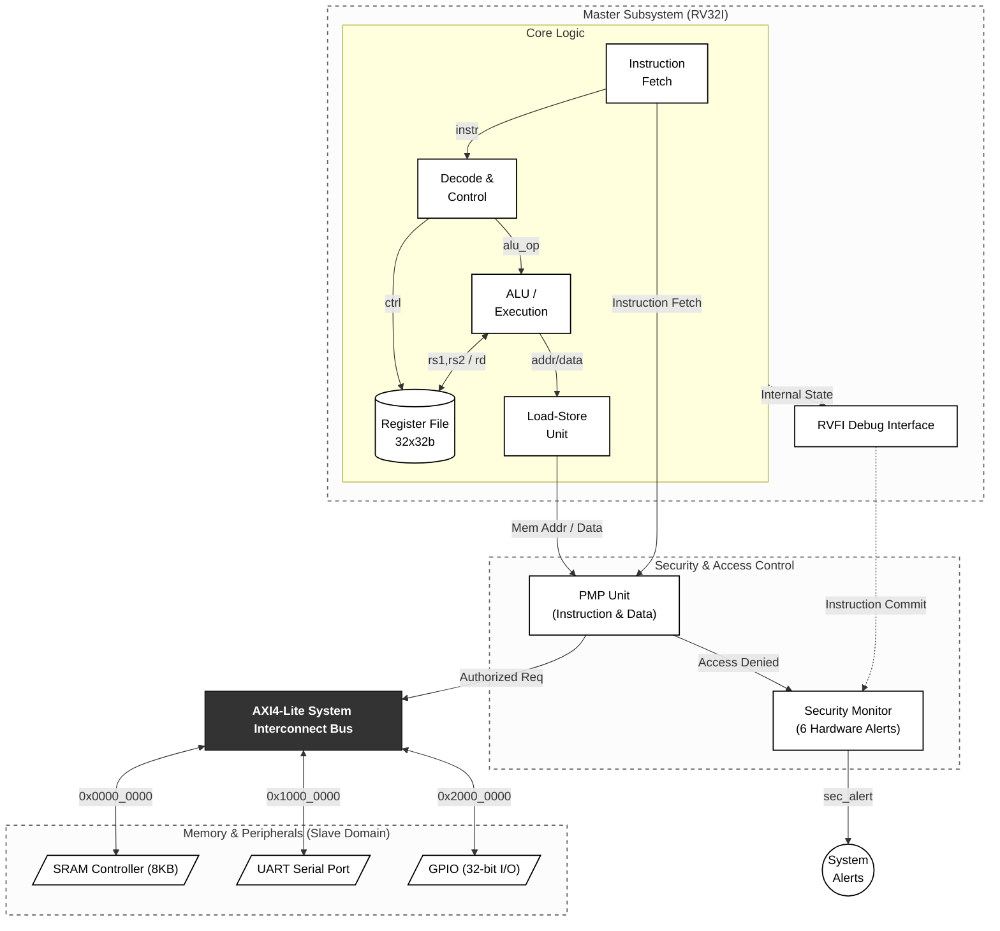
```mermaid
flowchart TD
    classDef default fill:#fff,stroke:#000,stroke-width:1.5px,color:#000
    classDef bus fill:#333,stroke:#000,stroke-width:1px,color:#fff,font-weight:bold
    classDef subsystem fill:#fcfcfc,stroke:#666,stroke-width:1.5px,stroke-dasharray: 5 5

    %% Master Devices
    subgraph Master ["Master Subsystem (RV32I)"]
        direction TB
        
        subgraph CPU ["Core Logic"]
            direction LR
            Fetch["Instruction<br>Fetch"]
            Decode["Decode &<br>Control"]
            Regs[("Register File<br>32x32b")]
            ALU["ALU /<br>Execution"]
            LSU["Load-Store<br>Unit"]

            Fetch -->|instr| Decode
            Decode -->|alu_op| ALU
            Decode -->|ctrl| Regs
            ALU <-->|rs1,rs2 / rd| Regs
            ALU -->|addr/data| LSU
        end
        
        RVFI["RVFI Debug Interface"]
        CPU -.->|Internal State| RVFI
    end

    %% Security & Access Control
    subgraph Security ["Security & Access Control"]
        direction LR
        PMP["PMP Unit<br>(Instruction & Data)"]
        SecMon["Security Monitor<br>(6 Hardware Alerts)"]
        PMP -->|Access Denied| SecMon
    end

    %% Central Bus
    AXI["AXI4-Lite System Interconnect Bus"]:::bus

    %% Slave Devices
    subgraph Slaves ["Memory & Peripherals (Slave Domain)"]
        direction LR
        SRAM[/"SRAM Controller (8KB)"/]
        UART[/"UART Serial Port"/]
        GPIO[/"GPIO (32-bit I/O)"/]
    end

    %% Data flow routing
    LSU -->|Mem Addr / Data| PMP
    Fetch -->|Instruction Fetch| PMP
    PMP -->|Authorized Req| AXI
    RVFI -.->|Instruction Commit| SecMon
    
    AXI <-->|0x0000_0000| SRAM
    AXI <-->|0x1000_0000| UART
    AXI <-->|0x2000_0000| GPIO

    %% Alerts out
    SecMon -->|sec_alert| Alerts((System<br>Alerts))

    class Master,Security,Slaves subsystem
```
<p align="center"><em>Fig. 1: SecVeriRL SoC architecture — RV32I core with PMP, security monitor, and AXI4-Lite peripherals.</em></p>

---

## 2. AI-Driven Verification Engine

The core innovation of this project is a **two-stage AI verification loop** that autonomously drives coverage closure:

### 2.1 Architecture Overview

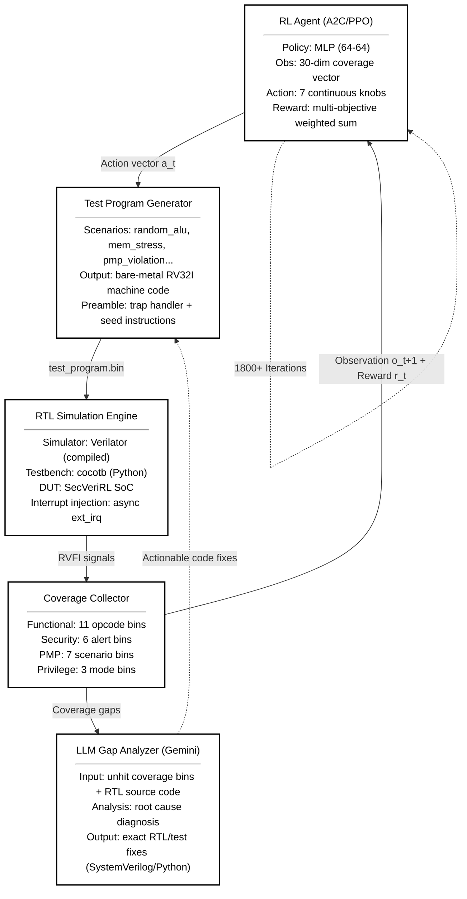
```mermaid
flowchart TD
    classDef default fill:#fff,stroke:#000,stroke-width:2px,color:#000
    classDef group fill:#f9f9f9,stroke:#333,stroke-width:2px,stroke-dasharray: 5 5,color:#000

    RL["RL Agent (A2C/PPO)<br><hr>Policy: MLP (64-64)<br>Obs: 30-dim coverage vector<br>Action: 7 continuous knobs<br>Reward: multi-objective weighted sum"]
    Gen["Test Program Generator<br><hr>Scenarios: random_alu, mem_stress, pmp_violation...<br>Output: bare-metal RV32I machine code<br>Preamble: trap handler + seed instructions"]
    Sim["RTL Simulation Engine<br><hr>Simulator: Verilator (compiled)<br>Testbench: cocotb (Python)<br>DUT: SecVeriRL SoC<br>Interrupt injection: async ext_irq"]
    Cov["Coverage Collector<br><hr>Functional: 11 opcode bins<br>Security: 6 alert bins<br>PMP: 7 scenario bins<br>Privilege: 3 mode bins"]
    LLM["LLM Gap Analyzer (Gemini)<br><hr>Input: unhit coverage bins + RTL source code<br>Analysis: root cause diagnosis<br>Output: exact RTL/test fixes (SystemVerilog/Python)"]

    RL -->|Action vector a_t| Gen
    Gen -->|test_program.bin| Sim
    Sim -->|RVFI signals| Cov
    Cov -->|Observation o_t+1 + Reward r_t| RL
    Cov -->|Coverage gaps| LLM
    LLM -.->|Actionable code fixes| Gen

    %% Loop annotation
    RL -.->|1800+ Iterations| RL
```
<p align="center"><em>Fig. 2: Closed-loop AI verification architecture — RL agent generates test knobs, simulation produces coverage, LLM analyzes remaining gaps.</em></p>

### 2.2 Stage 1: RL-Based Adaptive Test Generation

The RL agent is formulated as a **Gymnasium environment** with a continuous action space:

**Observation Space** (30 dimensions):
- Instruction type bins (11): LUI, AUIPC, JAL, JALR, BRANCH, LOAD, STORE, IMM, REG, FENCE, SYSTEM
- Privilege mode bins (3): User, Supervisor, Machine
- Security alert bins (6): PMP violation, privilege escalation, illegal CSR, illegal instruction, secure region access, rapid traps
- PMP scenario bins (7): U-mode read/write/exec in M-region, M-mode read/write, PMP config, PMP lock
- Aggregate metrics (3): functional/security/PMP coverage percentages

**Action Space** (7 continuous knobs):

| Knob | Range | Controls |
|------|-------|----------|
| `test_scenario` | 9 options | random_alu, memory_stress, pmp_violation, privilege_switch, interrupt_storm, csr_access, bus_protocol, security_alerts, mixed |
| `pmp_config_mode` | 4 options | all_open, m_only_secure, mixed_permissions, locked_regions |
| `privilege_bias` | [0, 1] | Probability of running in U-mode vs M-mode |
| `memory_pattern` | 4 options | sequential, random, boundary, crossing |
| `interrupt_rate` | [0, 1] | External interrupt injection frequency |
| `illegal_insn_rate` | [0, 0.3] | Rate of deliberate illegal instruction insertion |
| `test_length` | [50, 500] | Number of instructions per test |

**Reward Function** (multi-objective):
```
R = 0.3 × ΔFunctional + 0.4 × ΔSecurity + 0.2 × ΔPMP + 0.1 × NewBins − 0.05 × Stagnation
```

The agent is trained using **Advantage Actor-Critic (A2C)** with an MLP policy, observing coverage after each simulation and learning which test scenarios maximize coverage improvement.

### 2.3 Stage 2: LLM-Powered Coverage Gap Analysis

When the RL agent reaches a coverage plateau, the **Gemini LLM** is invoked to analyze remaining gaps:

1. **Gap Identification**: Extracts which specific coverage bins remain unhit
2. **RTL Source Analysis**: Reads the relevant SystemVerilog modules (decoder, security monitor, PMP unit)
3. **Root Cause Diagnosis**: Determines if gaps are due to RTL bugs, test generator limitations, or signal connectivity
4. **Actionable Fixes**: Generates exact code changes (SystemVerilog or Python) to close each gap

This LLM stage acts as an **automated verification engineer** — replacing days of manual debug with structured, targeted analysis.

### 2.4 Test Program Generation

The test generator produces **bare-metal RV32I machine code** (not assembly) with:

- **Deterministic preamble**: Trap handler setup + one instruction of every opcode type (guarantees baseline coverage)
- **Scenario-driven body**: RL-selected instruction mix targeting specific coverage bins
- **Security sequences**: PMP configuration, privilege mode switches via MRET, deliberate access violations
- **Interrupt injection**: Asynchronous external interrupts during execution

---

## 3. Verification Results & Metrics

### 3.1 Coverage Improvement Over Training

The RL agent was trained for **1800+ simulation iterations**. Coverage improved dramatically compared to random testing:

| Metric | Random Testing | RL-Driven (Final) | Improvement |
|--------|---------------|-------------------|-------------|
| **Functional Coverage** | 45% | **100%** (11/11 opcodes) | +122% |
| **Security Coverage** | 17% | **100%** (6/6 alerts) | +488% |
| **PMP Coverage** | 14% | **100%** (7/7 scenarios) | +614% |
| **Privilege Modes** | 1/3 | **2/3** (M + U) | +100% |
| **Privilege Transitions** | 0 | **2** (M↔U) | — |

### 3.2 Coverage Bin Details

#### Instruction Types (11/11 = 100%)
| Opcode | Instruction | Status |
|--------|------------|--------|
| `0x37` | LUI | ✅ |
| `0x17` | AUIPC | ✅ |
| `0x6F` | JAL | ✅ |
| `0x67` | JALR | ✅ |
| `0x63` | BRANCH | ✅ |
| `0x03` | LOAD | ✅ |
| `0x23` | STORE | ✅ |
| `0x13` | IMM (ADDI/SLTI/...) | ✅ |
| `0x33` | REG (ADD/SUB/...) | ✅ |
| `0x0F` | FENCE | ✅ |
| `0x73` | SYSTEM (CSR/ECALL) | ✅ |

#### Security Alerts (6/6 = 100%)
| Code | Alert Type | Status |
|------|-----------|--------|
| `0x01` | PMP Violation | ✅ |
| `0x02` | Privilege Escalation | ✅ |
| `0x03` | Illegal CSR Access | ✅ |
| `0x04` | Illegal Instruction | ✅ |
| `0x05` | Secure Region Access | ✅ |
| `0x06` | Rapid Traps (DoS) | ✅ |

#### PMP Scenarios (7/7 = 100%)
| Scenario | Status |
|----------|--------|
| U-mode READ from M-region | ✅ |
| U-mode WRITE to M-region | ✅ |
| U-mode EXEC from M-region | ✅ |
| M-mode READ all regions | ✅ |
| M-mode WRITE all regions | ✅ |
| PMP config register written | ✅ |
| PMP region locked | ✅ |

### 3.3 Key Insight: Why AI Matters

Traditional constrained-random verification would require a human engineer to manually:
1. Write directed tests for each security scenario
2. Debug why specific PMP configurations weren't being exercised
3. Trace coverage gaps back to RTL signal connectivity issues

Our RL agent **autonomously discovered** that:
- `pmp_violation` scenarios must be combined with `m_only_secure` PMP mode
- Privilege switches require a specific `MRET` sequence (not just CSR writes)
- Security alert coverage is order-dependent — trap handlers must be installed first

The LLM gap analyzer then identified the remaining gaps as requiring **multi-step attack sequences** (e.g., configure PMP → switch to U-mode → execute from protected region) — sequences that pure random testing would take exponentially longer to discover.

---

## 4. Physical Design (RTL-to-GDSII)

The verified SoC was taken through the complete **RTL-to-GDSII** flow using **OpenROAD Flow Scripts (ORFS)** targeting the **SkyWater 130nm HD** standard cell library.

### 4.1 Physical Design Parameters

| Parameter | Value |
|-----------|-------|
| **Target Frequency** | 50 MHz |
| **Die Area** | 2000 × 2000 µm² |
| **Core Utilization** | 20% |
| **SRAM Macro** | sky130_sram_2kbyte_1rw1r_32x512_8 (×4 = 8KB) |
| **Standard Cells** | ~6,200 (li1 layer) |
| **Metal Stack** | 5 layers (li1 + met1–met4, met5 for power) |
| **DRC Violations** | **0** |
| **Antenna Violations** | **0** |
| **LVS** | **Clean** |

### 4.2 Layout Visualizations

<p align="center">
  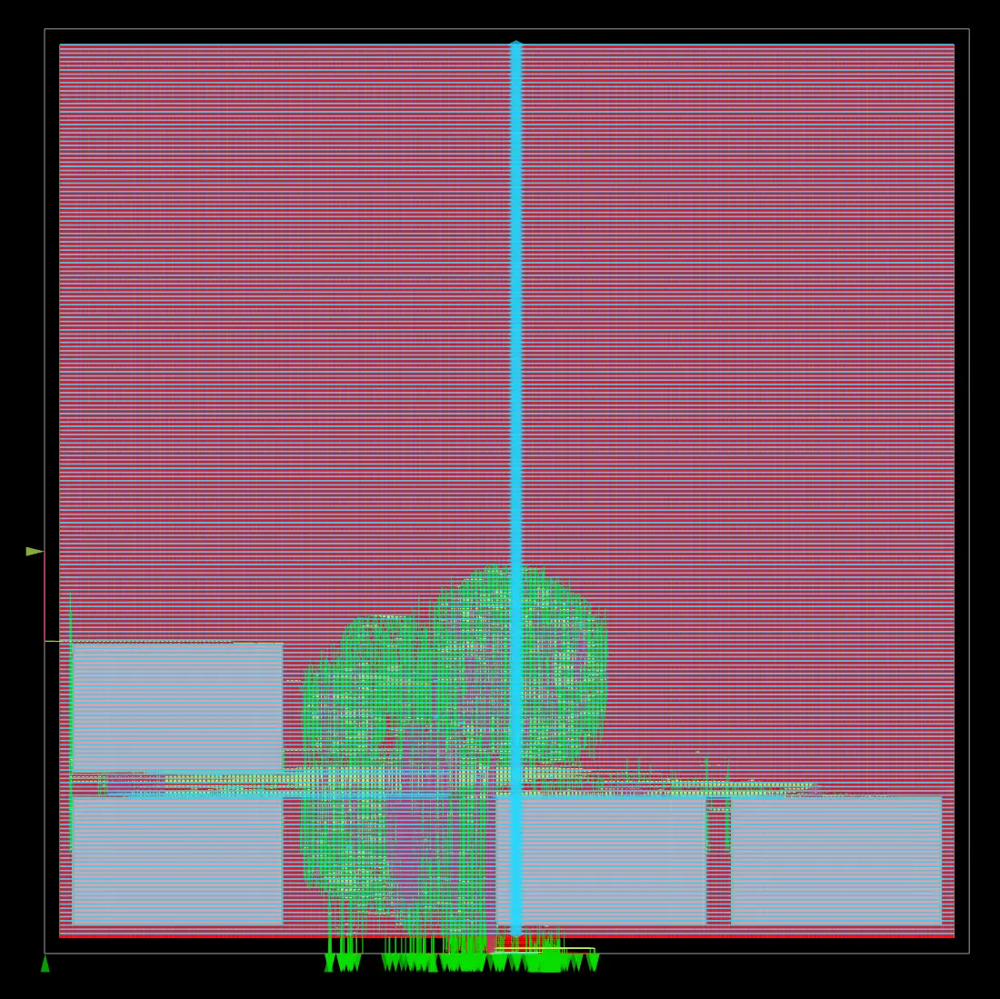
  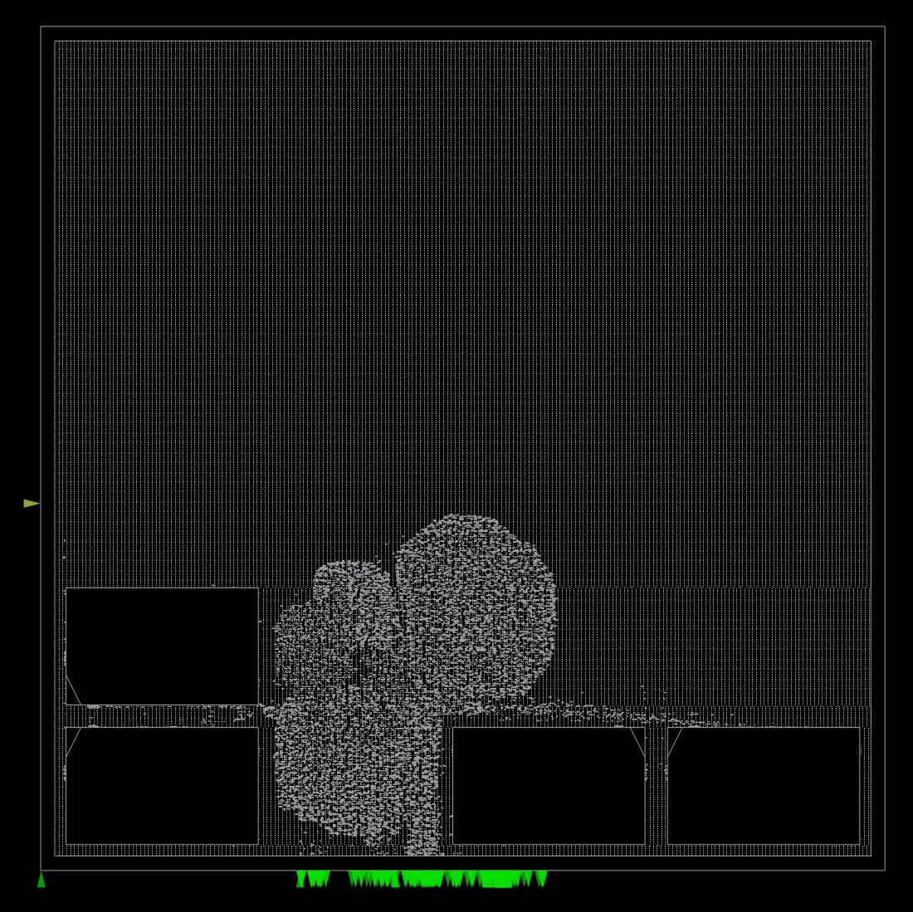
</p>
<p align="center"><em>Left: Final routed layout (all layers). Right: Standard cell placement with SRAM macros.</em></p>

<p align="center">
  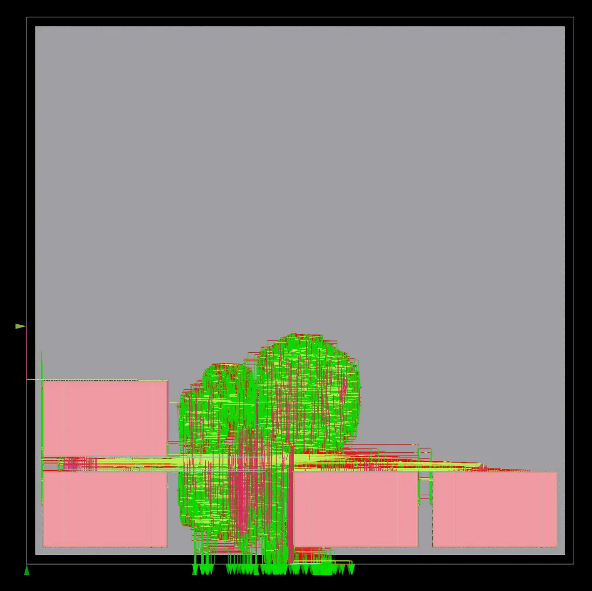
  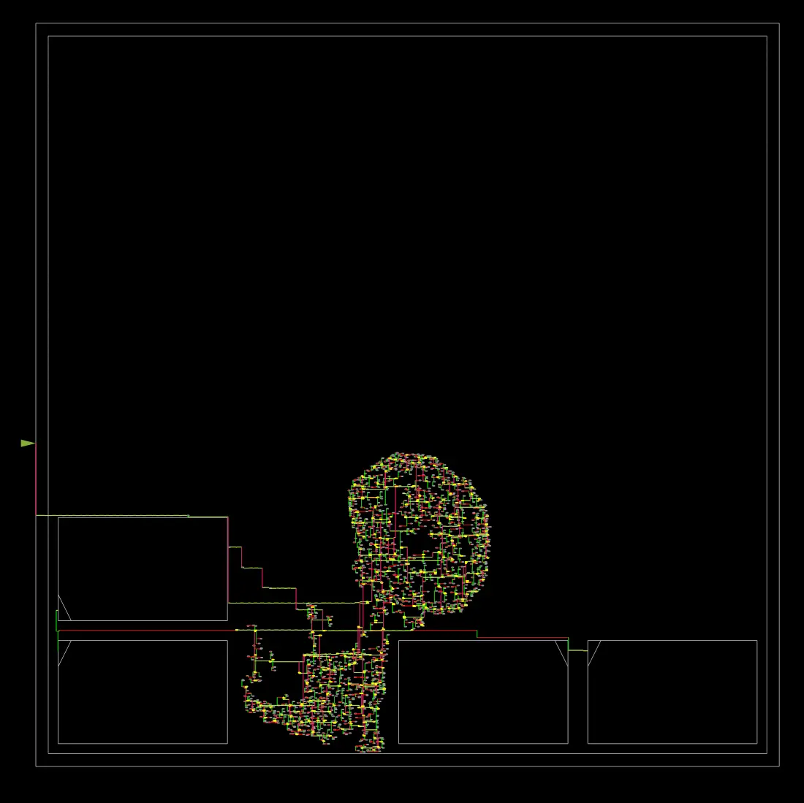
</p>
<p align="center"><em>Left: Metal routing overview. Right: Clock tree synthesis (CTS) result.</em></p>

### 4.3 Signoff Reports

<p align="center">
  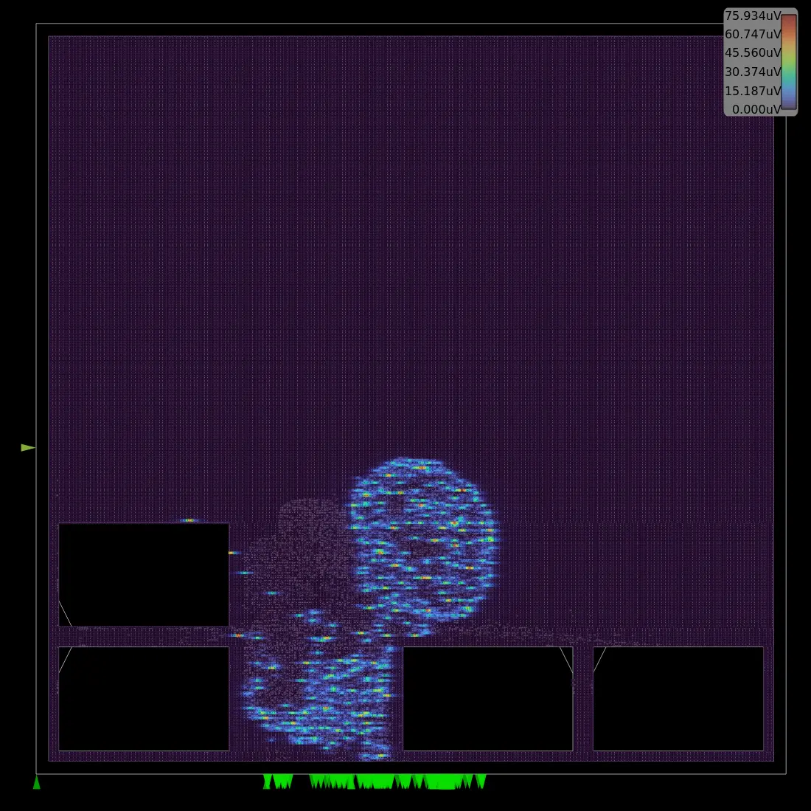
  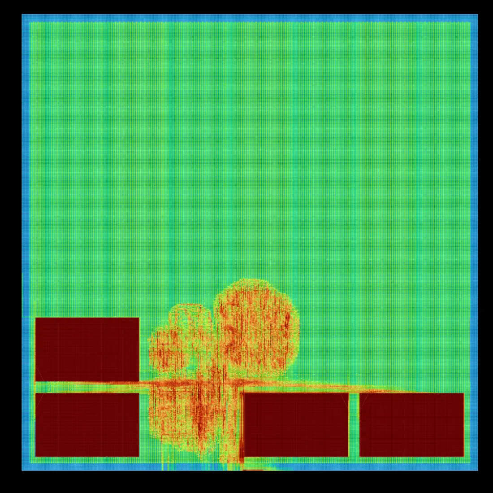
  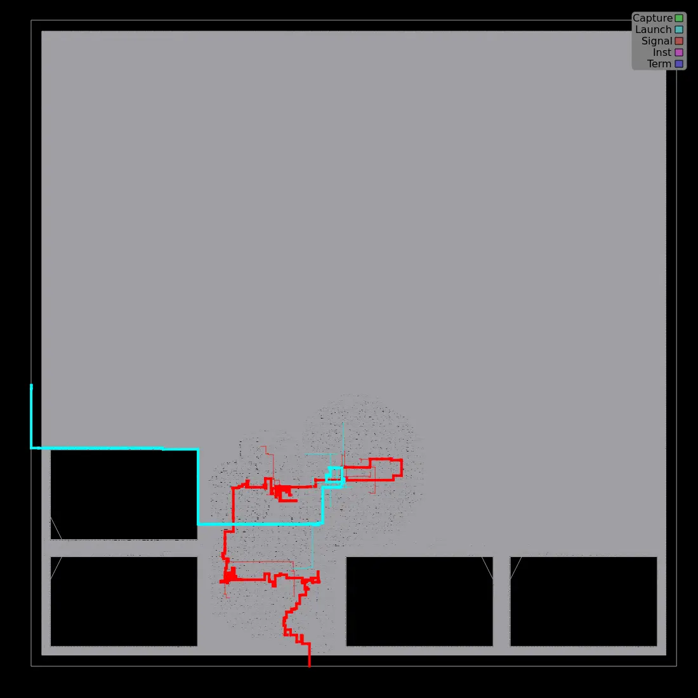
</p>
<p align="center"><em>Left to right: IR drop analysis, routing congestion heatmap, worst timing path.</em></p>

### 4.4 3D Silicon Visualization

The GDSII was rendered in 3D using **GDS3D** to visualize the metal stack:

<p align="center">
  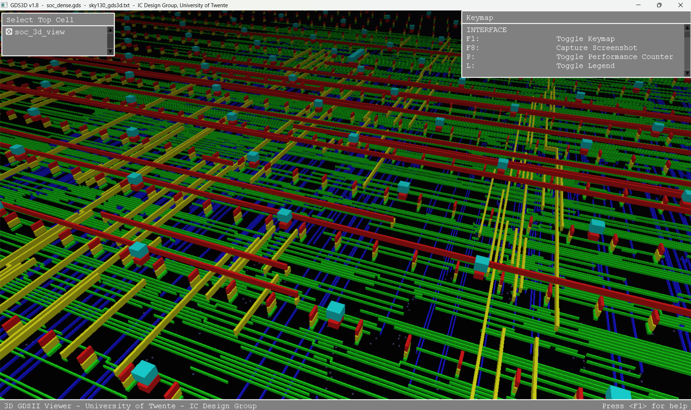
</p>
<p align="center"><em>3D view of the SoC metal routing stack — each color represents a different metal layer (blue=met1, green=met2, yellow=met3, red=met4, cyan=met5).</em></p>

<p align="center">
  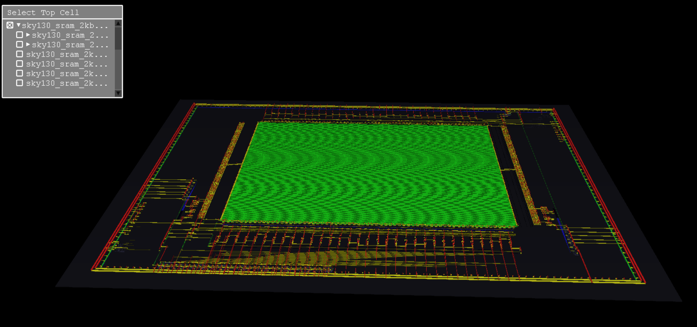
  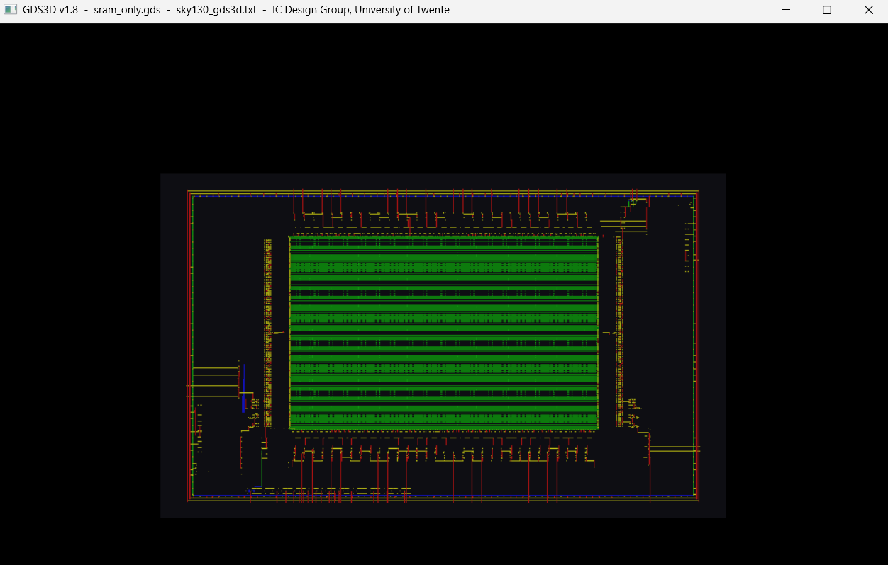
</p>
<p align="center"><em>Left: 3D view of the SRAM macro with routing visible. Right: SRAM macro top-down view.</em></p>

### 4.5 3D Flythrough Video

https://github.com/user-attachments/assets/video.mp4

> **Note**: If the video doesn't render above, see `physical_design/video.mp4` in this repository.

---

## 5. Repository Structure

```
├── rtl/                          # SystemVerilog RTL source
│   ├── core/                     # RV32I CPU core
│   │   ├── rv32i_core.sv         #   Top-level core with RVFI
│   │   ├── rv32i_alu.sv          #   Arithmetic Logic Unit
│   │   ├── rv32i_decoder.sv      #   Instruction decoder
│   │   ├── rv32i_lsu.sv          #   Load-Store Unit
│   │   ├── rv32i_control.sv      #   FSM control + CSR/trap
│   │   └── rv32i_regfile.sv      #   Register file
│   ├── security/                 # Hardware security modules
│   │   ├── pmp_unit.sv           #   Physical Memory Protection
│   │   └── security_monitor.sv   #   Real-time threat detector
│   ├── bus/                      # Bus infrastructure
│   │   └── axi_lite_interconnect.sv
│   ├── peripherals/              # SoC peripherals
│   │   ├── axi_lite_sram.sv
│   │   ├── axi_lite_uart.sv
│   │   └── axi_lite_gpio.sv
│   ├── pkg/                      # Package definitions
│   │   └── secverirl_pkg.sv
│   └── top/                      # SoC top-level
│       └── secverirl_soc_top.sv
│
├── ai_engine/                    # AI verification engine
│   ├── agent/
│   │   └── secverirl_agent.py    # RL agent (A2C/PPO + Gymnasium env)
│   ├── feedback/
│   │   └── __init__.py
│   └── llm_debugger.py           # Gemini-powered coverage gap analyzer
│
├── verification/                 # Verification environment
│   ├── cocotb_env/
│   │   └── tb_top.py             # cocotb testbench + coverage collector
│   ├── formal/
│   │   └── security.sby          # SymbiYosys formal verification
│   └── Makefile                  # Verilator simulation driver
│
├── physical_design/              # ASIC implementation artifacts
│   ├── secverirl_soc_top.v       # Synthesizable Verilog netlist
│   ├── constraint.sdc            # Timing constraints (50 MHz)
│   ├── final_*.webp              # OpenROAD layout images
│   ├── 3d_*.png                  # GDS3D 3D visualizations
│   └── video.mp4                 # 3D flythrough video
│
├── config/                       # Configuration files
│   ├── project_config.yaml
│   └── dut_profiles/
│       ├── rv32i_basic.yaml
│       └── ibex.yaml
│
├── scripts/                      # Automation scripts
│   ├── run_secverirl.py          # Main runner
│   ├── run_synthesis.py          # Synthesis automation
│   └── analyze_coverage.py       # Coverage analysis
│
├── results/                      # Training & simulation results
│   ├── coverage_result.json      # Final coverage report
│   ├── coverage_history.json     # Coverage over 1800+ iterations
│   └── rl_model.zip              # Trained A2C model
│
└── requirements.txt              # Python dependencies
```

---

## 6. Getting Started

### Prerequisites

- Python 3.9+
- [Verilator](https://verilator.org/) (for RTL simulation)
- [cocotb](https://www.cocotb.org/) (Python testbench framework)

### Installation

```bash
git clone https://github.com/yourusername/secverirl.git
cd secverirl
pip install -r requirements.txt
```

### Run Verification

```bash
# Run the full cocotb testbench
make -f verification/Makefile SIM=verilator

# Train the RL agent (standalone)
python ai_engine/agent/secverirl_agent.py --mode train --timesteps 10000

# Run LLM gap analysis
python ai_engine/llm_debugger.py --coverage results/coverage_result.json
```

### Run Physical Design (requires OpenROAD)

```bash
# In the OpenROAD-flow-scripts environment:
make DESIGN_CONFIG=flow/designs/sky130hd/secverirl_soc/config.mk
```

---

## 7. Citation

If you use this work in your research, please cite:

```bibtex
@misc{secverirl2026,
  title={Reinforcement Learning-Driven Security Verification and Silicon
         Implementation of a RISC-V SoC},
  author={Anuj Gite, Vedanth Dhagay, Bhavik Somvanshi, Moksh Maru, Ishaan Gawde},
  year={2026},
  note={Open-source, RTL-to-GDSII with AI-augmented verification},
  url={https://github.com/yourusername/secverirl}
}
```

---

<p align="center">
  <strong>Built with ❤️ using open-source EDA tools</strong><br/>
  OpenROAD · SkyWater 130nm PDK · Verilator · cocotb · Stable-Baselines3 · Google Gemini
</p>
