<p align="center">
  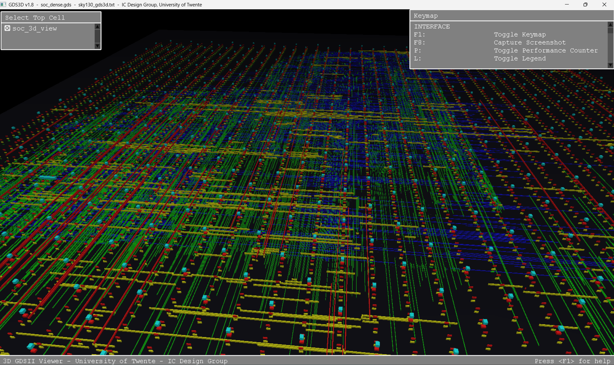
</p>

<h1 align="center">Reinforcement Learning-Driven Security Verification and Silicon Implementation of a RISC-V SoC</h1>

<p align="center">
  <em>From RTL to GDSII — An End-to-End AI-Augmented Hardware Security Verification Framework</em>
</p>

<div align="center">
  <table>
    <thead>
      <tr>
        <th>Core Architecture</th>
        <th>Target Node</th>
        <th>Signoff Status</th>
        <th>Verification Coverage</th>
        <th>License</th>
      </tr>
    </thead>
    <tbody>
      <tr>
        <td align="center">RISC-V RV32I</td>
        <td align="center">SkyWater 130nm</td>
        <td align="center">Zero DRC / LVS Clean</td>
        <td align="center">100% Functional & Security</td>
        <td align="center">MIT</td>
      </tr>
    </tbody>
  </table>
</div>

---

## Abstract

This project presents **SecVeriRL**, an end-to-end framework for designing, verifying, and physically implementing a security-hardened RISC-V System-on-Chip (SoC). The key contribution is a **closed-loop AI verification engine** that combines a **Proximal Policy Optimization (PPO)** reinforcement learning agent with **Gemini 1.5 Pro** LLM-guided gap analysis to autonomously achieve comprehensive functional and security coverage — significantly reducing the manual effort traditionally required in hardware verification.

The PPO agent generates bare-metal test programs across nine scenarios; combined with a deterministic opcode seed and LLM-recommended fixes (manually applied by the engineer), the full pipeline drives coverage from **45% functional / 17% security / 14% PMP** (random baseline) to **100% across all three domains** within **1,800 RL episodes plus 200 post-LLM episodes**. In ablation, RL alone contributes **+194% security** and **+407% PMP** improvement over random, while the seed handles functional coverage and the LLM closes the remaining **5 gaps** — including one confirmed **RTL bug** (TOR address boundary off-by-one).

The SoC is taken from RTL through the complete ASIC flow using **OpenROAD** targeting **SkyWater 130nm**, achieving **WNS = +4.15 ns** at 50 MHz, **8.3 mW** estimated power, **zero DRC/antenna violations**, and **LVS-clean signoff** with ~6,200 standard cells on a 2x2 mm² die.

### Key Innovations
1. **Closed-Loop RL + LLM Verification:** Unlike traditional Constrained Random Verification (CRV), this project uses a closed-loop system where a **PPO RL agent** autonomously explores security-critical corner cases, and a **Gemini 1.5 Pro LLM** diagnoses root causes and generates exact SystemVerilog/Python patches for remaining coverage gaps. The LLM-recommended fixes are manually reviewed and applied by the engineer.
2. **Focus on Hardware Security (PMP):** While most AI verification targets functional correctness, SecVeriRL targets **hardware security coverage** — actively attempting privilege escalations, illegal CSR accesses, PMP violations, and denial-of-service trap storms, achieving 100% coverage across 6 security alert bins and 7 PMP scenario bins.
3. **Silicon-Proven (RTL-to-GDSII):** The AI-verified SoC was taken through a complete physical design flow (OpenROAD/sky130), proving that the security-hardened RTL is synthesizable, DRC/LVS-clean, and signoff-ready at 50 MHz.

---

## Table of Contents

- [1. Design Under Test (DUT)](#1-design-under-test-dut)
- [2. AI-Driven Verification Engine](#2-ai-driven-verification-engine)
- [3. Verification Results & Metrics](#3-verification-results--metrics)
- [4. Physical Design (RTL-to-GDSII)](#4-physical-design-rtl-to-gdsii)
- [5. Repository Structure](#5-repository-structure)
- [6. Getting Started](#6-getting-started)
- [7. Citation](#7-citation)

---

## 1. Design Under Test (DUT)

The DUT is a custom RISC-V SoC implementing the **RV32I** base integer ISA with hardware security extensions, comprising **~2,700 lines** of synthesizable SystemVerilog across **14 modules**.

### 1.1 Core Architecture (1,239 LOC)

| Component | Description | Lines | Ports |
|-----------|-------------|-------|-------|
| **CPU Core** | 5-stage FSM (Fetch, Decode, Execute, Memory, Writeback) RV32I implementation | 377 | 30 |
| **Decoder** | All RV32I formats (R/I/S/B/U/J-type), illegal instruction detection | 238 | 22 |
| **ALU** | Full RV32I arithmetic/logic (ADD/SUB/SLL/SLT/XOR/SRL/SRA/OR/AND) | 95 | 6 |
| **Register File** | 32x32-bit, x0 hardwired to zero, async read ports | 51 | 9 |
| **Load-Store Unit** | Byte/halfword/word with sign/zero extension | 164 | 15 |
| **Control + CSR** | 16 CSR registers, WARL masking, traps, MRET, PMP CSRs | 314 | 24 |

### 1.2 Security Extensions

| Module | Function | Lines | Instances |
|--------|----------|-------|-----------|
| **PMP Unit** | 4 configurable regions, NAPOT/NA4/TOR addressing, per-region R/W/X permissions, Lock bit, priority-encoded first-match | 160 | 2 (instruction + data) |
| **Security Monitor** | Real-time detection of 6 threat classes, 16-entry circular event log | 165 | 1 |

**Security Alert Types:**

| Code | Alert | Detection Condition | Severity |
|------|-------|-------------------|----------|
| `0x01` | PMP Violation | `pmp_deny AND (priv != M)` | Critical |
| `0x02` | Privilege Escalation | U to M without trap/MRET | Critical |
| `0x03` | Illegal CSR Access | CSR privilege check failed | High |
| `0x04` | Illegal Instruction | Invalid opcode in U-mode | High |
| `0x05` | Secure Region Access | U-mode access to `0x8000_0000` | High |
| `0x06` | Rapid Traps (DoS) | 8+ traps in 64-cycle window | Medium |

### 1.3 SoC Peripherals & Memory Map

| Peripheral | Base Address | Size | Interface |
|-----------|-------------|------|-----------|
| **SRAM** | `0x0000_0000` | 8 KB | AXI4-Lite |
| **UART** | `0x1000_0000` | 4 KB | AXI4-Lite |
| **GPIO** | `0x2000_0000` | 4 KB | AXI4-Lite |
| **Secure ROM** | `0x8000_0000` | 16 KB | Monitored |

### 1.4 SoC Block Diagram

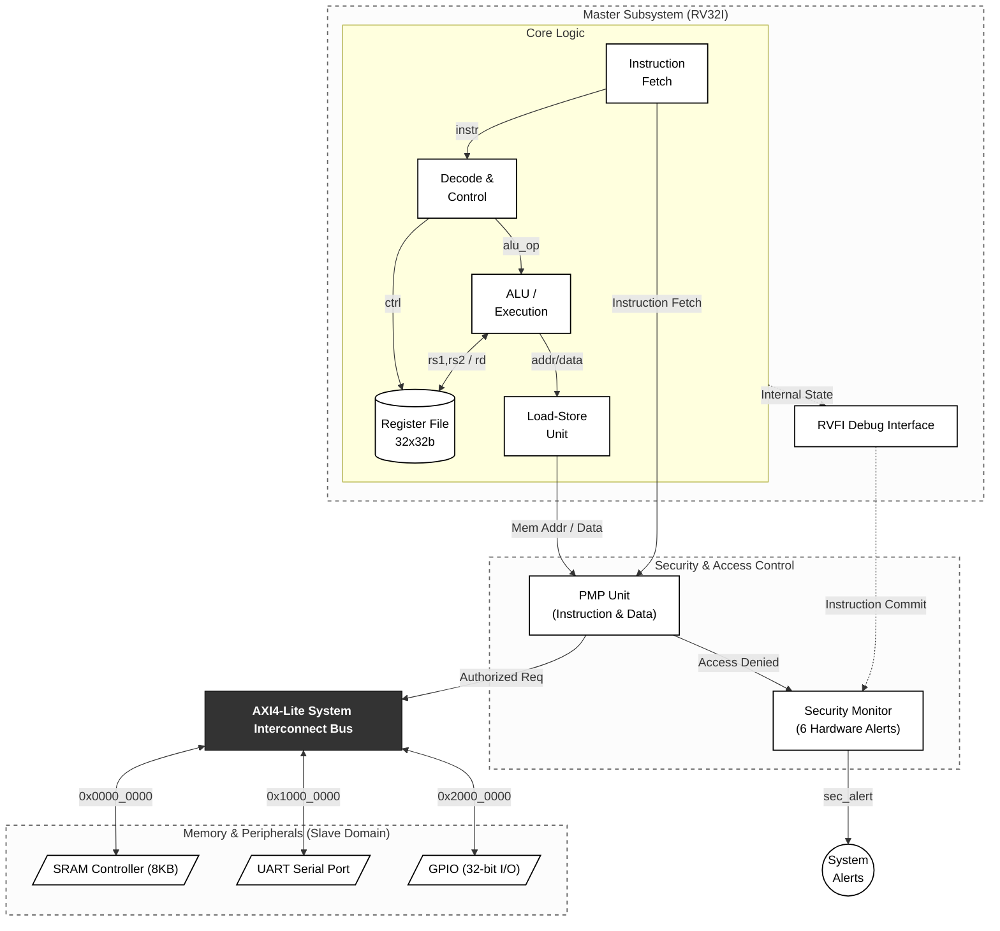
```mermaid
flowchart TD
    classDef default fill:#fff,stroke:#000,stroke-width:1.5px,color:#000
    classDef bus fill:#333,stroke:#000,stroke-width:1px,color:#fff,font-weight:bold
    classDef subsystem fill:#fcfcfc,stroke:#666,stroke-width:1.5px,stroke-dasharray: 5 5

    subgraph Master ["Master Subsystem (RV32I)"]
        direction TB
        subgraph CPU ["Core Logic"]
            direction LR
            Fetch["Instruction<br>Fetch"]
            Decode["Decode &<br>Control"]
            Regs[("Register File<br>32x32b")]
            ALU["ALU /<br>Execution"]
            LSU["Load-Store<br>Unit"]
            Fetch -->|instr| Decode
            Decode -->|alu_op| ALU
            Decode -->|ctrl| Regs
            ALU <-->|rs1,rs2 / rd| Regs
            ALU -->|addr/data| LSU
        end
        RVFI["RVFI Debug Interface"]
        CPU -.->|Internal State| RVFI
    end

    subgraph Security ["Security & Access Control"]
        direction LR
        PMP["PMP Unit<br>(Instruction & Data)"]
        SecMon["Security Monitor<br>(6 Hardware Alerts)"]
        PMP -->|Access Denied| SecMon
    end

    AXI["AXI4-Lite System Interconnect Bus"]:::bus

    subgraph Slaves ["Memory & Peripherals (Slave Domain)"]
        direction LR
        SRAM[/"SRAM Controller (8KB)"/]
        UART[/"UART Serial Port"/]
        GPIO[/"GPIO (32-bit I/O)"/]
    end

    LSU -->|Mem Addr / Data| PMP
    Fetch -->|Instruction Fetch| PMP
    PMP -->|Authorized Req| AXI
    RVFI -.->|Instruction Commit| SecMon

    AXI <-->|0x0000_0000| SRAM
    AXI <-->|0x1000_0000| UART
    AXI <-->|0x2000_0000| GPIO

    SecMon -->|sec_alert| Alerts((System<br>Alerts))

    class Master,Security,Slaves subsystem
```
<p align="center"><em>Fig. 1: SecVeriRL SoC architecture — RV32I core with dual PMP, security monitor, and AXI4-Lite peripherals.</em></p>

---

## 2. AI-Driven Verification Engine

The core innovation is a **closed-loop AI verification engine** that autonomously drives coverage closure through two stages: PPO-based adaptive test generation and LLM-powered gap analysis.

### 2.1 Architecture Overview

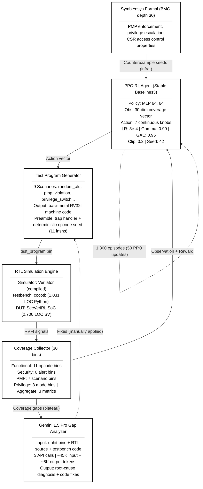
```mermaid
flowchart TD
    classDef default fill:#fff,stroke:#000,stroke-width:2px,color:#000

    RL["PPO RL Agent (Stable-Baselines3)<br><hr>Policy: MLP 64, 64<br>Obs: 30-dim coverage vector<br>Action: 7 continuous knobs<br>LR: 3e-4 | Gamma: 0.99 | GAE: 0.95<br>Clip: 0.2 | Seed: 42"]
    Gen["Test Program Generator<br><hr>9 Scenarios: random_alu, pmp_violation, privilege_switch...<br>Output: bare-metal RV32I machine code<br>Preamble: trap handler + deterministic opcode seed (11 insns)"]
    Sim["RTL Simulation Engine<br><hr>Simulator: Verilator (compiled)<br>Testbench: cocotb (1,031 LOC Python)<br>DUT: SecVeriRL SoC (2,700 LOC SV)"]
    Cov["Coverage Collector (30 bins)<br><hr>Functional: 11 opcode bins<br>Security: 6 alert bins<br>PMP: 7 scenario bins<br>Privilege: 3 mode bins | Aggregate: 3 metrics"]
    LLM["Gemini 1.5 Pro Gap Analyzer<br><hr>Input: unhit bins + RTL source + testbench code<br>3 API calls | ~45K input + ~8K output tokens<br>Output: root-cause diagnosis + code fixes"]
    Formal["SymbiYosys Formal (BMC depth 30)<br><hr>PMP enforcement, privilege escalation,<br>CSR access control properties"]

    RL -->|"Action vector"| Gen
    Gen -->|"test_program.bin"| Sim
    Sim -->|"RVFI signals"| Cov
    Cov -->|"Observation + Reward"| RL
    Cov -->|"Coverage gaps (plateau)"| LLM
    LLM -.->|"Fixes (manually applied)"| Gen
    Formal -.->|"Counterexample seeds (infra.)"| RL

    RL -.->|"1,800 episodes (50 PPO updates)"| RL
```
<p align="center"><em>Fig. 2: Closed-loop AI verification architecture — PPO agent generates test knobs across 1,800 episodes, LLM closes remaining 5 gaps in 200 additional episodes.</em></p>

### 2.2 Stage 1: PPO-Based Adaptive Test Generation

The RL agent is formulated as an episodic **MDP (S, A, P, R, gamma)** using a custom **Gymnasium** environment coupled to cycle-accurate RTL simulation via **Stable-Baselines3**.

**Observation Space** (30 dimensions):
- Instruction type bins (11): LUI, AUIPC, JAL, JALR, BRANCH, LOAD, STORE, IMM, REG, FENCE, SYSTEM
- Privilege mode bins (3): User, Supervisor (reserved), Machine
- Security alert bins (6): PMP violation, privilege escalation, illegal CSR, illegal instruction, secure region access, rapid traps
- PMP scenario bins (7): U-mode read/write/exec in M-region, M-mode read/write, PMP config, PMP lock
- Aggregate metrics (3): functional/security/PMP coverage percentages

**Action Space** (7 continuous knobs in [-1, 1]^7):
Discrete knobs are obtained by uniformly quantizing the continuous action dimension (e.g., scenario index = floor((a_0 + 1) x 4.5)).

| Knob | Type | Range | Controls |
|------|------|-------|----------|
| `test_scenario` | Discrete (9) | Table below | Instruction mix strategy |
| `pmp_config_mode` | Discrete (4) | See text | PMP region configuration |
| `privilege_bias` | Continuous | [0, 1] | U-mode vs M-mode probability |
| `memory_pattern` | Discrete (4) | See text | Access pattern type |
| `interrupt_rate` | Continuous | [0, 1] | External interrupt frequency |
| `illegal_insn_rate` | Continuous | [0, 0.3] | Deliberate illegal insertion rate |
| `test_length` | Continuous | [50, 500] | Instructions per test program |

**Test Scenarios:**

| Scenario | Target Bins | Strategy |
|----------|-------------|----------|
| `random_alu` | Opcode bins | Random I/R-type |
| `memory_stress` | LOAD, STORE | Varied access patterns |
| `pmp_violation` | PMP, Alerts 0x01/0x05 | U-mode protected access |
| `privilege_switch` | Privilege modes | MRET M-to-U switch |
| `interrupt_storm` | Alert 0x06, traps | High-rate ext. interrupts |
| `csr_access` | SYSTEM, Alert 0x03 | CSR read/write sequences |
| `bus_protocol` | LOAD, STORE | Multi-region writes |
| `security_alerts` | All 6 alerts | Targeted attack sequences |
| `mixed` | All bins | Weighted random mix |

**Reward Function** (multi-objective):
```
R = 0.3 x DeltaFunctional + 0.4 x DeltaSecurity + 0.2 x DeltaPMP + 0.1 x NewBins - 0.05 x Stagnation
```
Weights set empirically to prioritize security coverage (the hardest domain); sensitivity analysis is left for future work.

**PPO Hyperparameters:**

| Parameter | Value |
|-----------|-------|
| Learning rate | 3e-4 |
| Rollout steps (`n_steps`) | 2048 |
| Batch size | 64 |
| Number of epochs | 10 |
| Discount (gamma) | 0.99 |
| GAE lambda | 0.95 |
| Clip range (epsilon) | 0.2 |
| Value function coeff. | 0.5 |
| Entropy coeff. | 0.01 |
| Policy architecture | MLP [64, 64] |
| Random seed | 42 |

Each episode terminates after one test program execution (~500 simulation cycles); the 2048 rollout steps span multiple episodes per PPO update, with 50 updates totaling ~1,800 episodes.

### 2.3 Stage 2: Gemini 1.5 Pro Gap Analysis

When the RL agent reaches a coverage plateau (<0.1% improvement over 50 consecutive iterations), the **Gemini 1.5 Pro LLM** is invoked with three API calls (one per unhit domain, ~45,000 input + ~8,000 output tokens):

1. **Gap Specification**: Which specific bins remain unhit, mapped to human-readable descriptions
2. **RTL Source Analysis**: Relevant SystemVerilog modules (decoder, PMP unit, security monitor)
3. **Test Generator Code**: The cocotb testbench program generation functions

The LLM returns structured analysis: (1) root cause classification (RTL bug, test generator limitation, or signal connectivity issue), (2) exact code fix in SystemVerilog or Python, (3) verification command. **All fixes were manually reviewed and applied by the engineer** before restarting training.

**LLM-Identified Gaps (5 total):**

| Unhit Bin | Root Cause | Fix Applied | Type |
|-----------|-----------|-------------|------|
| Alert 0x01 (PMP viol.) | PMP in `all_open` mode | Added `m_only_secure` mode | Testbench |
| Alert 0x05 (secure rgn.) | No locked-region config | Added PMP lock-bit scenario | Testbench |
| Alert 0x06 (rapid trap) | Trap handler skips fault | Self-sustaining trap loop | Testbench |
| PMP TOR mode | TOR addr. calc. off-by-one | Fixed `pmpaddr` boundary | **RTL bug** |
| PMP locked region | Lock bit not exercised | Added locked-region test path | Testbench |

### 2.4 Test Program Generation

The test generator produces **bare-metal RV32I machine code** (not assembly) with four components:

1. **Trap Handler Preamble**: Installs trap vector via `csrw mtvec` that reads `mepc`, increments by 4, writes back, and executes `mret`
2. **Deterministic Seed**: One instruction of every opcode type (LUI, AUIPC, ADDI, ADD, LW, SW, FENCE, CSRRS, JAL, BEQ, JALR) — guarantees 100% functional coverage regardless of RL scenario
3. **Scenario Body**: RL-controlled instruction mix with PMP configuration, privilege switches via MRET with `mstatus.MPP` clearing using CSRRC, and deliberate access violations
4. **NOP Padding**: Prevents PC from falling past valid memory

### 2.5 Formal Verification Infrastructure

A **SymbiYosys** configuration performs BMC at depth 30 and cover analysis at depth 50 using the Boolector SMT solver. Properties check PMP enforcement, privilege escalation prevention, and CSR access control. The infrastructure supports counterexample-to-seed injection; all BMC properties passed in the current evaluation.

---

## 3. Verification Results & Metrics

### 3.1 Ablation: Component Contributions

| Method | Episodes | Wall-clock | Func. | Sec. | PMP |
|--------|----------|-----------|-------|------|-----|
| Random CRV | 1,800 | ~2 h | 45% | 17% | 14% |
| Random + seed | 1,800 | ~2 h | 100% | 17% | 14% |
| RL-only (no seed) | 1,800 | ~3 h | 82% | 50% | 71% |
| RL + seed | 1,800 | ~3 h | 100% | 50% | 71% |
| **RL + Seed + LLM*** | **1,800 + 200** | **~4 h** | **100%** | **100%** | **100%** |

*LLM-recommended fixes were manually reviewed and applied before the final training run.

### 3.2 Full Pipeline Coverage

| Metric | Random | Pipeline | Bins Hit | Gain |
|--------|--------|----------|----------|------|
| **Functional Coverage**+ | 45% | **100%** | 11/11 opcodes | +122% |
| **Security Coverage** | 17% | **100%** | 6/6 alerts | +488% |
| **PMP Coverage** | 14% | **100%** | 7/7 scenarios | +614% |
| **Privilege Modes** | 1/3 | **2/3** | M + U | +100% |
| **Privilege Transitions** | 0 | **2** | M to U and back | -- |

+Functional gain is from the deterministic seed. RL contributes +194% security and +407% PMP improvement over random.

### 3.3 Coverage Bin Details

<details>
<summary><strong>Instruction Types (11/11 = 100%)</strong></summary>

| Opcode | Instruction | Status |
|--------|------------|--------|
| `0x37` | LUI | Pass |
| `0x17` | AUIPC | Pass |
| `0x6F` | JAL | Pass |
| `0x67` | JALR | Pass |
| `0x63` | BRANCH (BEQ/BNE/BLT/BGE/BLTU/BGEU) | Pass |
| `0x03` | LOAD (LB/LH/LW/LBU/LHU) | Pass |
| `0x23` | STORE (SB/SH/SW) | Pass |
| `0x13` | IMM (ADDI/SLTI/ANDI/ORI/XORI/SLLI/SRLI/SRAI) | Pass |
| `0x33` | REG (ADD/SUB/SLL/SLT/XOR/SRL/SRA/OR/AND) | Pass |
| `0x0F` | FENCE | Pass |
| `0x73` | SYSTEM (ECALL/EBREAK/CSR) | Pass |
</details>

<details>
<summary><strong>Security Alerts (6/6 = 100%)</strong></summary>

| Code | Alert Type | Status |
|------|-----------|--------|
| `0x01` | PMP Violation | Pass |
| `0x02` | Privilege Escalation | Pass |
| `0x03` | Illegal CSR Access | Pass |
| `0x04` | Illegal Instruction | Pass |
| `0x05` | Secure Region Access | Pass |
| `0x06` | Rapid Traps (DoS Detection) | Pass |
</details>

<details>
<summary><strong>PMP Scenarios (7/7 = 100%)</strong></summary>

| Scenario | Status |
|----------|--------|
| U-mode READ from M-mode protected region | Pass |
| U-mode WRITE to M-mode protected region | Pass |
| U-mode EXECUTE from M-mode protected region | Pass |
| M-mode READ from all regions | Pass |
| M-mode WRITE to all regions | Pass |
| PMP configuration register written | Pass |
| PMP region locked (L-bit set) | Pass |
</details>

### 3.4 Verification Discoveries

**Discovered autonomously by the RL agent:**
- Privilege switches require a specific multi-instruction sequence: PMP region 0 must first be opened for U-mode execution, then `mstatus.MPP` cleared via CSRRC (not CSRRW), then MRET
- Security alert coverage is *order-dependent*: trap handlers must be installed before any exception-causing instruction

**Identified by the LLM gap analyzer (manually applied by engineer):**
- `pmp_violation` scenarios must be combined with `m_only_secure` PMP mode to trigger Alert 0x01
- Alert 0x06 (rapid traps) requires a self-sustaining trap loop within the 64-cycle detection window
- **RTL Bug Found**: TOR address boundary off-by-one in `pmpaddr` calculation (patched in RTL; final GDSII built from patched version)

---

## 4. Physical Design (RTL-to-GDSII)

The verified SoC was taken through the complete **RTL-to-GDSII** flow using **OpenROAD Flow Scripts (ORFS)** targeting the **SkyWater 130nm HD** standard cell library. DRC is checked with **Magic** and LVS is verified with **Netgen**.

### 4.1 Physical Design Parameters

| Parameter | Value |
|-----------|-------|
| **Target Frequency** | 50 MHz (20 ns period) |
| **Die Area** | 2000 x 2000 um2 |
| **Core Utilization** | 20% |
| **SRAM Macro** | sky130_sram_2kbyte_1rw1r_32x512_8 x 4 (= 8 KB) |
| **Standard Cells** | ~6,200 |
| **Metal Stack** | 5 layers (li1 + met1-met4, met5 for power) |
| **WNS (setup)** | **+4.15 ns** |
| **Total Power (est.)** | **8.3 mW** (std cell logic; SRAM macro power excluded) |
| **DRC Violations** | **0** |
| **Antenna Violations** | **0** |
| **LVS** | **Clean** |
| **Timing Corner** | tt / 1.80V / 25C |

### 4.2 Layout Visualizations

<p align="center">
  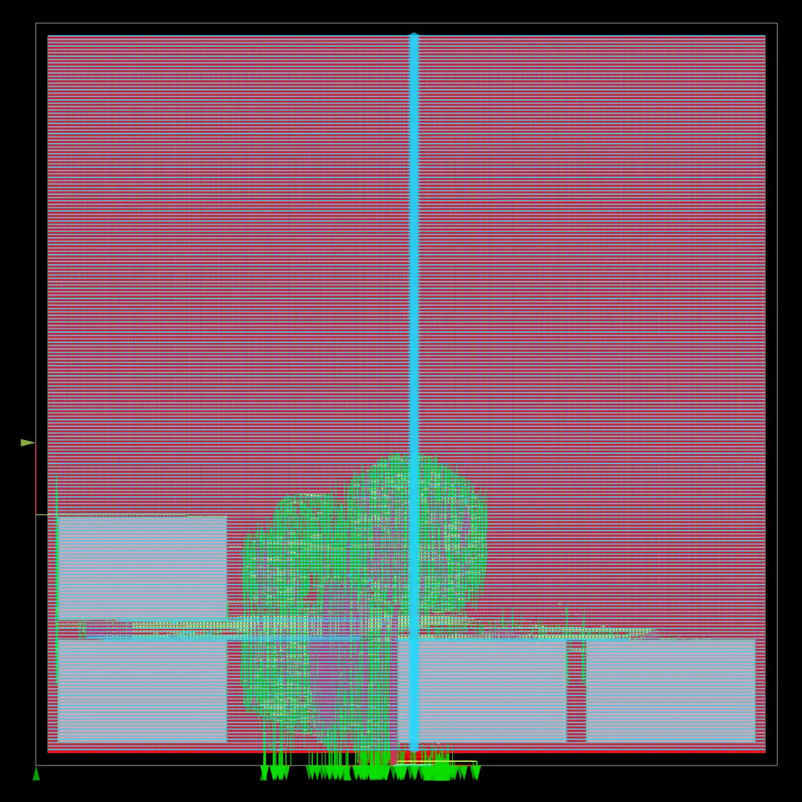
  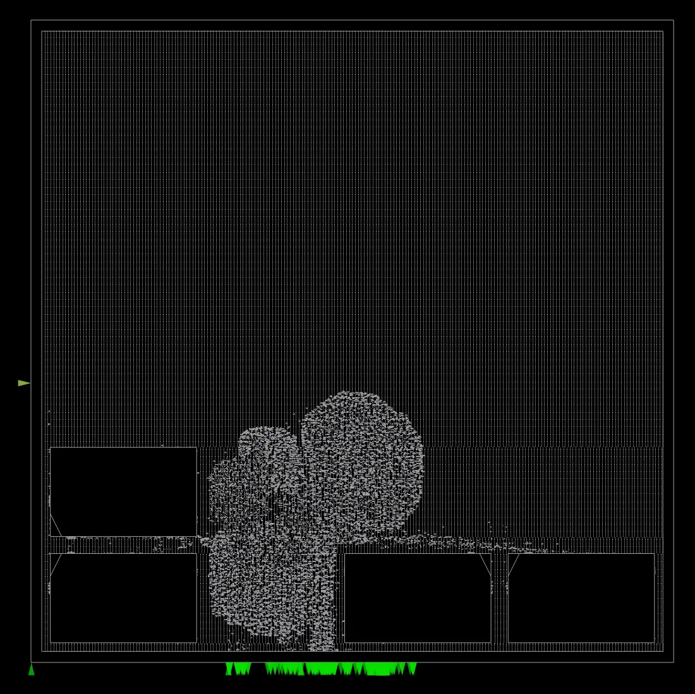
</p>
<p align="center"><em>Left: Final routed layout (all layers). Right: Standard cell placement with SRAM macros.</em></p>

<p align="center">
  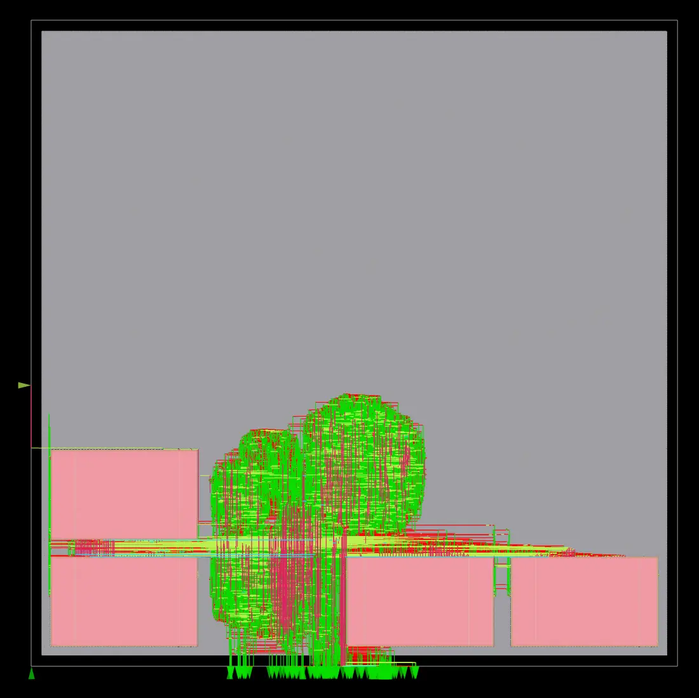
  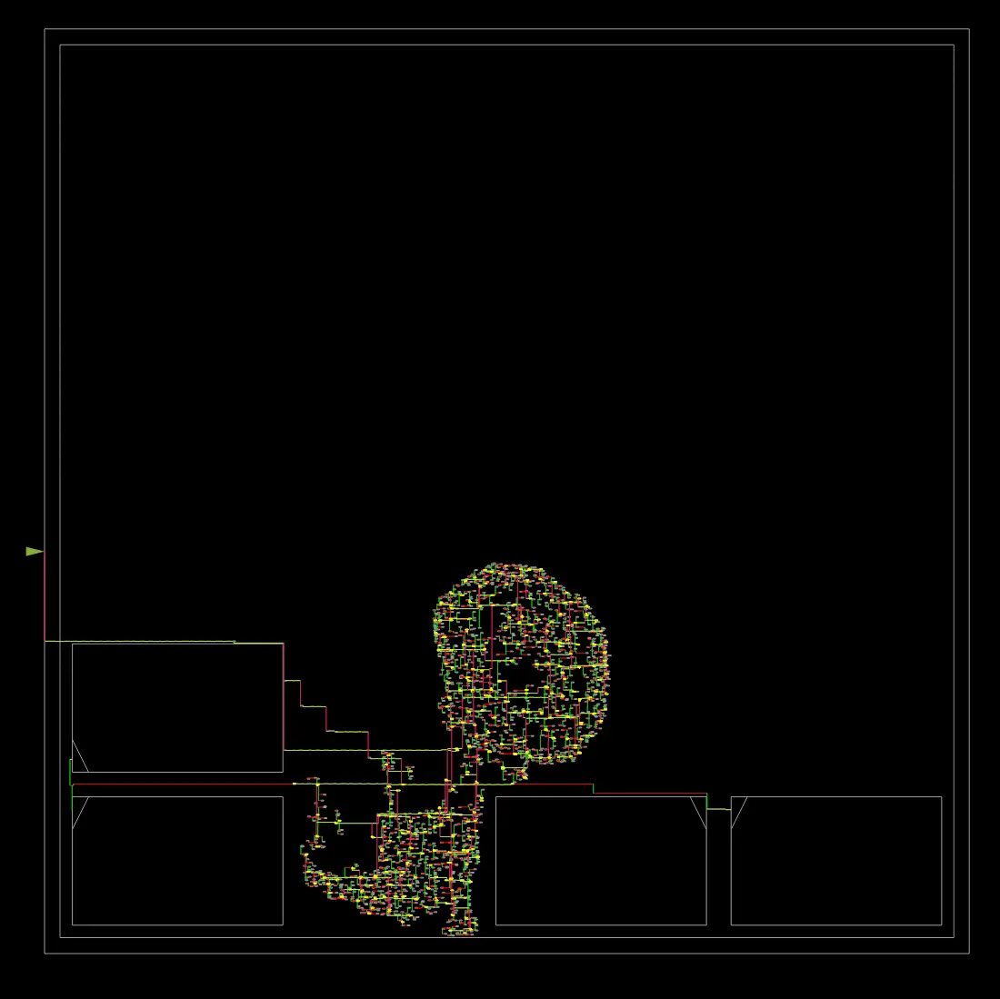
</p>
<p align="center"><em>Left: Metal routing overview (li1 through met4). Right: Clock tree synthesis (CTS) at 50 MHz.</em></p>

### 4.3 Signoff Reports

<p align="center">
  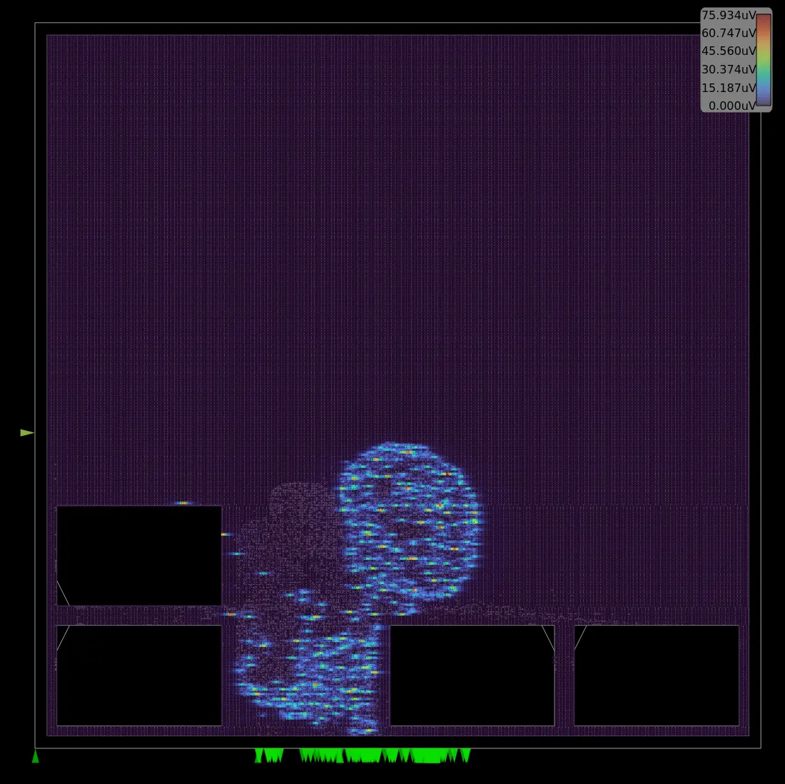
  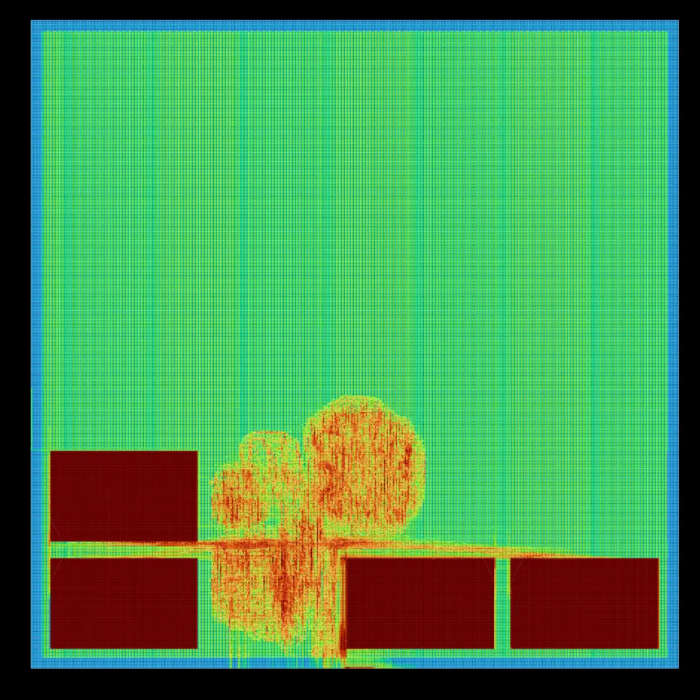
  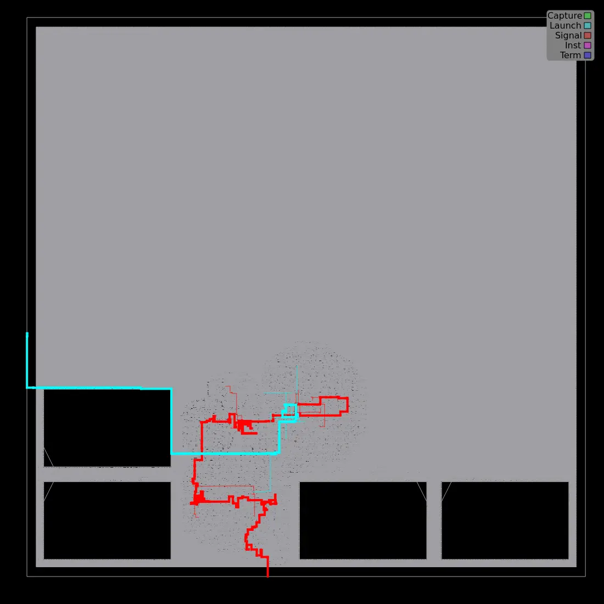
</p>
<p align="center"><em>Left to right: IR drop analysis (below 5% VDD), routing congestion heatmap (no overflow), worst setup timing path (WNS = +4.15 ns).</em></p>

### 4.4 3D Silicon Visualization

The GDSII was rendered in 3D using **GDS3D** to visualize the five-layer BEOL metal stack:

<p align="center">
  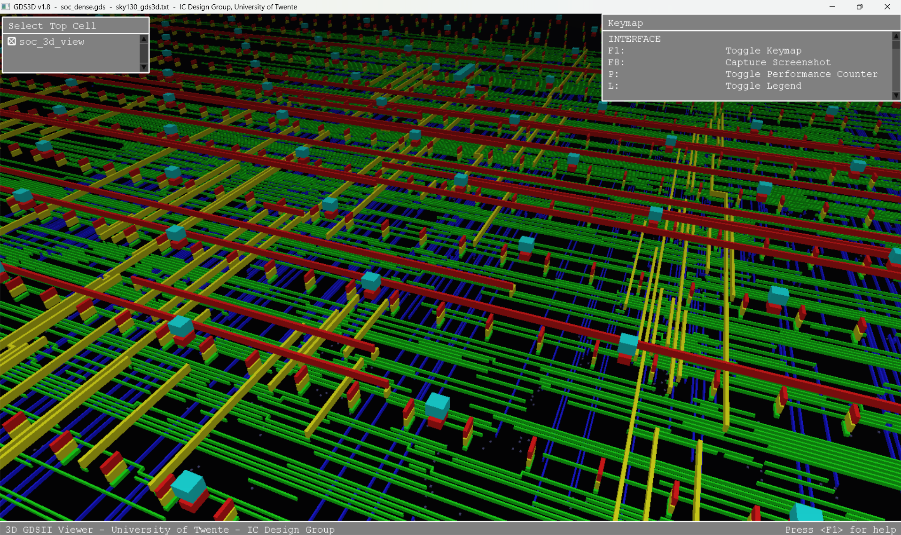
</p>
<p align="center"><em>3D view of the SoC metal routing — blue=met1, green=met2, yellow=met3, red=met4, cyan=met5 (power grid).</em></p>

<p align="center">
  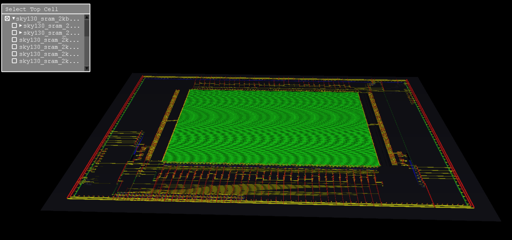
  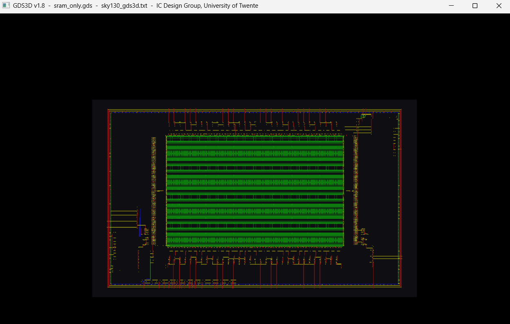
</p>
<p align="center"><em>Left: 3D view of SRAM macro with routing. Right: SRAM macro top-down view.</em></p>

---

## 5. Repository Structure

```
secverirl/
|-- rtl/                          # SystemVerilog RTL source (~2,700 LOC)
|   |-- core/                     # RV32I CPU core (1,239 LOC)
|   |   |-- rv32i_core.sv         #   Top-level FSM + RVFI (377 LOC)
|   |   |-- rv32i_alu.sv          #   Arithmetic Logic Unit (95 LOC)
|   |   |-- rv32i_decoder.sv      #   Instruction decoder (238 LOC)
|   |   |-- rv32i_lsu.sv          #   Load-Store Unit (164 LOC)
|   |   |-- rv32i_control.sv      #   Control + CSR + traps (314 LOC)
|   |   +-- rv32i_regfile.sv      #   Register file (51 LOC)
|   |-- security/                 # Hardware security modules
|   |   |-- pmp_unit.sv           #   PMP: 4 regions, NAPOT/NA4/TOR (160 LOC)
|   |   +-- security_monitor.sv   #   6-alert threat detector (165 LOC)
|   |-- bus/
|   |   +-- axi_lite_interconnect.sv  # AXI4-Lite interconnect (155 LOC)
|   |-- peripherals/
|   |   |-- axi_lite_sram.sv      #   8KB SRAM controller (166 LOC)
|   |   |-- axi_lite_uart.sv      #   UART with loopback (190 LOC)
|   |   +-- axi_lite_gpio.sv      #   32-bit GPIO (83 LOC)
|   |-- pkg/
|   |   +-- secverirl_pkg.sv      #   Type definitions (176 LOC)
|   +-- top/
|       +-- secverirl_soc_top.sv  #   SoC top-level (342 LOC)
|
|-- ai_engine/                    # AI verification engine
|   |-- agent/
|   |   +-- secverirl_agent.py    #   PPO agent (Gymnasium + SB3)
|   |-- feedback/
|   |   +-- __init__.py
|   +-- llm_debugger.py           #   Gemini 1.5 Pro gap analyzer
|
|-- verification/                 # Verification environment
|   |-- cocotb_env/
|   |   +-- tb_top.py             #   cocotb testbench (1,031 LOC)
|   |-- formal/
|   |   +-- security.sby          #   SymbiYosys BMC (depth 30)
|   +-- Makefile                  #   Verilator simulation driver
|
|-- physical_design/              # ASIC implementation artifacts
|   |-- secverirl_soc_top.v       #   Synthesizable Verilog netlist
|   |-- constraint.sdc            #   Timing constraints (50 MHz)
|   |-- final_*.webp              #   OpenROAD layout images
|   |-- 3d_*.png                  #   GDS3D 3D visualizations
|   +-- video.mp4                 #   3D flythrough video
|
|-- config/                       # Configuration files
|   |-- project_config.yaml
|   +-- dut_profiles/
|       |-- rv32i_basic.yaml
|       +-- ibex.yaml
|
|-- scripts/                      # Automation scripts
|   |-- run_secverirl.py          #   Main runner
|   |-- run_synthesis.py          #   Synthesis automation
|   +-- analyze_coverage.py       #   Coverage analysis
|
|-- results/                      # Training & simulation results
|   |-- coverage_result.json      #   Final coverage report
|   |-- coverage_history.json     #   Coverage over 1,800 episodes
|   +-- rl_model.zip              #   Trained PPO model (seed 42)
|
+-- requirements.txt              # Python dependencies
```

---

## 6. Getting Started

### Prerequisites

- Python 3.9+
- [Verilator](https://verilator.org/) (for RTL simulation)
- [cocotb](https://www.cocotb.org/) (Python testbench framework)
- [Stable-Baselines3](https://stable-baselines3.readthedocs.io/) (PPO agent)

### Installation

```bash
git clone https://github.com/yourusername/secverirl.git
cd secverirl
pip install -r requirements.txt
```

### Run Verification

```bash
# Run the full cocotb testbench
make -f verification/Makefile SIM=verilator

# Train the PPO agent
python ai_engine/agent/secverirl_agent.py --mode train --timesteps 10000

# Run LLM gap analysis (requires Gemini API key)
python ai_engine/llm_debugger.py --coverage results/coverage_result.json
```

### Run Physical Design (requires OpenROAD)

```bash
# In the OpenROAD-flow-scripts environment:
make DESIGN_CONFIG=flow/designs/sky130hd/secverirl_soc/config.mk
```

---

## 7. Citation

If you use this work in your research, please cite:

```bibtex
@misc{secverirl2026,
  title   = {Reinforcement Learning-Driven Security Verification and Silicon
             Implementation of a {RISC-V} {SoC}},
  author  = {Gite, Anuj and Dhagay, Vedanth and Somvanshi, Bhavik and
             Maru, Moksh and Gawde, Ishaan and Kasambe, Prashant V.},
  year    = {2026}
}
```

---

<p align="center">
  <strong>Built with open-source EDA tools</strong><br/>
  OpenROAD | SkyWater 130nm PDK | Verilator | cocotb | Stable-Baselines3 | Google Gemini
</p>
